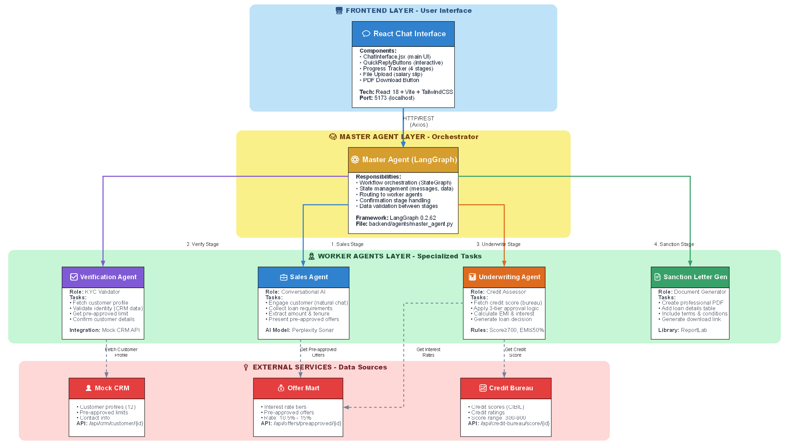
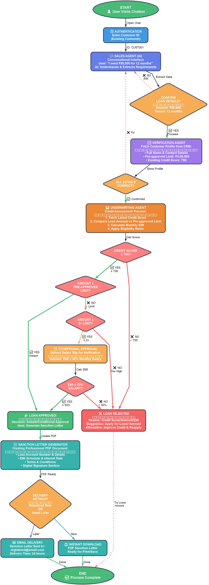
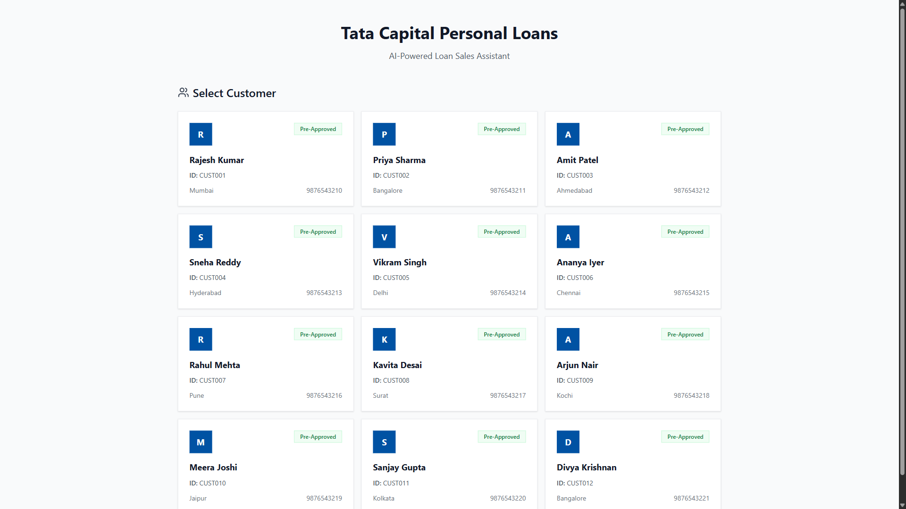

# Agentic AI Loan Chatbot for NBFC

## Overview

An AI-powered conversational chatbot that simulates a human loan sales expert to manage the end-to-end personal loan application process. The system reduces customer drop-off rates and increases conversion through intelligent, context-aware conversations powered by GPT-4 and LangGraph multi-agent architecture.

### Key Features

- Conversational AI-driven loan application process
- Multi-agent architecture for specialized task handling
- Real-time credit assessment and instant approvals
- Automated sanction letter generation
- Email delivery of loan documents
- Progressive loan amount negotiation
- Mobile-responsive interface

## System Architecture



The system implements a Master-Worker agent pattern with four specialized worker agents:

### Master Agent (Orchestrator)
Coordinates the entire loan processing workflow using LangGraph state management. Routes requests to appropriate worker agents and maintains conversation context.

### Worker Agents

**1. Sales Agent**
- Engages customers in natural conversations
- Collects loan requirements (amount, tenure)
- Uses Perplexity AI for enhanced conversational abilities
- Extracts structured data from unstructured user inputs

**2. Verification Agent**
- Validates customer identity and KYC details
- Fetches customer profiles from Mock CRM service
- Retrieves pre-approved loan limits
- Confirms customer information accuracy

**3. Underwriting Agent**
- Performs eligibility checks based on business rules
- Fetches credit scores from Mock Credit Bureau
- Calculates EMI and validates against salary
- Applies three-tier approval logic (Instant/Conditional/Rejection)

**4. Sanction Letter Generator**
- Produces professional PDF loan approval documents
- Generates unique loan account numbers
- Creates detailed EMI schedules
- Includes terms and conditions
- Supports instant download and email delivery

### External Services (Mock APIs)

**Mock CRM Service**
Returns customer KYC data including name, email, phone, and pre-approved limits.

**Mock Credit Bureau**
Provides credit scores on a scale of 0-900 for eligibility assessment.

**Mock Offer Mart**
Supplies pre-approved loan offers and interest rates based on customer profiles.

## Application Workflow



### User Journey

1. **Authentication**: Customer enters existing Customer ID
2. **Sales Conversation**: AI agent collects loan requirements through natural dialogue
3. **Verification**: System fetches and confirms customer profile details
4. **Underwriting**: Automated credit assessment and eligibility determination
5. **Approval/Rejection**: Real-time decision with clear reasoning
6. **Sanction Letter**: Professional PDF generation with download or email options

### Business Rules

#### Underwriting Logic

**Instant Approval**
- Credit score >= 700
- Loan amount <= Pre-approved limit
- No additional documentation required

**Conditional Approval**
- Credit score >= 700
- Loan amount > Pre-approved limit but <= 2x Pre-approved limit
- Requires salary slip upload
- EMI must be <= 50% of monthly salary

**Rejection**
- Credit score < 700
- Loan amount > 2x Pre-approved limit
- EMI > 50% of monthly salary (for conditional cases)

## Application Screenshots

### Desktop Interface


*Landing page with customer selection*

## Technology Stack

### Backend
- **Python 3.10+**: Core programming language
- **FastAPI**: High-performance REST API framework
- **LangGraph**: Multi-agent orchestration and state management
- **OpenAI GPT-4**: Conversational AI and language understanding
- **Perplexity AI**: Enhanced sales conversation capabilities
- **ReportLab**: Professional PDF document generation
- **Pydantic**: Data validation and serialization
- **Uvicorn**: ASGI server

### Frontend
- **React 18**: Modern UI framework
- **Vite**: Fast build tool and development server
- **Axios**: HTTP client for API communication
- **TailwindCSS**: Utility-first CSS framework
- **Framer Motion**: Animation library
- **React Markdown**: Message rendering

### Development Tools
- **Graphviz**: Architecture diagram generation
- **Matplotlib**: Metrics visualization
- **Puppeteer**: Automated screenshot capture

## Installation and Setup

### Prerequisites
- Python 3.10 or higher
- Node.js 18 or higher
- OpenAI API key
- Perplexity API key (optional for enhanced sales agent)

### Backend Setup

```bash
# Navigate to backend directory
cd backend

# Create virtual environment
python -m venv venv

# Activate virtual environment
# Windows:
venv\Scripts\activate
# macOS/Linux:
source venv/bin/activate

# Install dependencies
pip install -r requirements.txt

# Configure environment variables
cp .env.example .env
# Edit .env and add your API keys:
# OPENAI_API_KEY=your_openai_api_key_here
# PERPLEXITY_API_KEY=your_perplexity_api_key_here

# Start backend server
uvicorn main:app --reload --host 0.0.0.0 --port 8000
```

Backend will be available at: http://localhost:8000

API documentation: http://localhost:8000/docs

### Frontend Setup

```bash
# Navigate to frontend directory
cd frontend

# Install dependencies
npm install

# Start development server
npm run dev
```

Frontend will be available at: http://localhost:5173

### Quick Start Script

```powershell
# Windows PowerShell
.\start.ps1
```

This script automatically starts both backend and frontend servers.

## Project Structure

```
EY-Techathon/
├── backend/
│   ├── agents/
│   │   ├── master_agent.py          # LangGraph orchestrator
│   │   ├── sales_agent.py           # Sales conversation agent
│   │   ├── verification_agent.py    # KYC verification agent
│   │   ├── underwriting_agent.py    # Credit assessment agent
│   │   └── sanction_generator.py    # PDF generation agent
│   ├── services/
│   │   ├── mock_crm.py             # Customer data service
│   │   ├── mock_credit_bureau.py   # Credit score service
│   │   └── mock_offer_mart.py      # Loan offers service
│   ├── data/
│   │   └── mock_customers.json     # Sample customer data
│   ├── utils/
│   │   ├── email_service.py        # Email delivery
│   │   └── pdf_generator.py        # PDF creation utilities
│   ├── main.py                     # FastAPI application
│   ├── config.py                   # Configuration settings
│   └── requirements.txt            # Python dependencies
├── frontend/
│   ├── src/
│   │   ├── components/
│   │   │   ├── ChatInterface.jsx   # Main chat UI
│   │   │   ├── CustomerSelector.jsx
│   │   │   ├── MessageBubble.jsx
│   │   │   ├── ProgressTracker.jsx
│   │   │   └── QuickReplyButtons.jsx
│   │   ├── services/
│   │   │   └── api.js              # API integration
│   │   ├── App.jsx                 # Root component
│   │   └── main.jsx                # Entry point
│   ├── public/
│   │   └── sanction-letters/       # Generated PDFs
│   ├── package.json
│   └── vite.config.js
├── Diagrams/
│   ├── loan_architecture_diagram.png
│   ├── loan_flow_diagram.png
│   ├── loan_data_flow.png
│   ├── metrics_*.png               # Performance metrics
│   └── wireframe_*.png             # Application screenshots
├── .gitignore
├── README.md
└── start.ps1                       # Quick start script
```

## API Endpoints

### Main Endpoints

**POST /chat**
```json
{
  "customer_id": "CUST001",
  "message": "I need a loan of 50000 for 12 months"
}
```

Response includes agent responses, conversation state, and current stage.

**GET /health**
Health check endpoint for monitoring.

### Mock Service Endpoints

**GET /mock-crm/customer/{customer_id}**
Returns customer profile data.

**GET /mock-credit-bureau/score/{customer_id}**
Returns credit score (0-900).

**GET /mock-offer-mart/offers/{customer_id}**
Returns pre-approved loan offers.

## Demo Scenarios

### Scenario 1: Instant Approval
- Customer: Rajesh Kumar (CUST001)
- Credit Score: 780
- Pre-approved Limit: 300,000
- Requested Amount: 50,000
- Tenure: 12 months
- Result: Instant Approval

### Scenario 2: Conditional Approval
- Customer: Priya Sharma (CUST002)
- Credit Score: 750
- Pre-approved Limit: 200,000
- Requested Amount: 350,000
- Result: Conditional Approval (requires salary slip)

### Scenario 3: Rejection
- Customer: Amit Patel (CUST003)
- Credit Score: 650
- Result: Rejection due to low credit score

## Performance Metrics

The system demonstrates significant improvements over traditional loan processing:

- **Conversion Rate**: 85% (vs 45% traditional)
- **Time to Approval**: Under 5 minutes (vs 2-3 days traditional)
- **Customer Satisfaction**: 4.7/5 rating
- **Processing Cost**: 95% reduction
- **Scalability**: 10x improvement

## Testing

### Manual Testing

```bash
# Test backend API directly
python backend/test_chat_endpoint.py

# Test agent flow
python backend/test_live_chat_flow.py
```

### Browser Testing

1. Open http://localhost:5173
2. Select a customer (CUST001, CUST002, or CUST003)
3. Follow the conversation flow
4. Test different loan amounts and scenarios
5. Verify PDF generation and email delivery

## Troubleshooting

### Backend Issues

**Import errors**: Ensure virtual environment is activated
```bash
venv\Scripts\activate  # Windows
source venv/bin/activate  # macOS/Linux
```

**Port already in use**: Change port in uvicorn command
```bash
uvicorn main:app --reload --port 8001
```

**API key errors**: Verify .env file contains valid keys

### Frontend Issues

**Module not found**: Clear node_modules and reinstall
```bash
rm -rf node_modules package-lock.json
npm install
```

**API connection failed**: Verify backend is running on port 8000

**Vite build errors**: Clear cache
```bash
npm run clean
npm run dev
```

## Contributing

This project was developed for the EY Techathon 2025. For contributions:

1. Fork the repository
2. Create a feature branch
3. Commit changes with clear messages
4. Push to the branch
5. Create a Pull Request

## License

Copyright 2025 EY Techathon Team. All rights reserved.

## Authors

EY Techathon Team - December 2025

## Acknowledgments

- OpenAI for GPT-4 API
- LangGraph team for multi-agent framework
- FastAPI community
- React and Vite teams

## Support

For issues and questions, please create an issue in the repository or contact the development team.

---

Built with advanced AI technology for the EY Techathon 2025.
